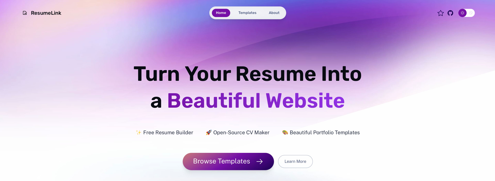

## ResumeLink: Building the future of online resumes and portfolios

A free, open-source platform that transforms your resume, CV, or portfolio into stunning web pages. Browse professional templates, get inspired, and create your online presence - no design or coding skills required.

## 🎯 Our Vision

ResumeLink aims to democratize professional resume and portfolio creation. We believe everyone deserves access to beautiful, professional templates and the tools to showcase their skills effectively. Our mission is to eliminate barriers between talent and opportunity through innovative web technology.

## ✨ Current Features

### 🎨 Template Gallery
- **Professional Templates**: Curated collection of modern resume and portfolio designs
- **Diverse Styles**: Academic, Creative, Corporate, Tech, and Industry-specific layouts
- **Preview & Browse**: Explore templates before choosing your perfect match
- **Mobile Responsive**: All templates optimized for every device

### 🛠️ Technical Excellence
- **Modern Tech Stack**: Built with Astro, TypeScript, and cutting-edge CSS
- **Lightning Fast**: Optimized for speed and performance
- **SEO Optimized**: Search engine friendly with structured data
- **Open Source**: Transparent development and community-driven

### 🌍 Accessibility
- **Free Forever**: No hidden costs or premium barriers
- **Global Reach**: Targeting English-speaking markets worldwide
- **Privacy First**: Minimal data collection, maximum user control

## 🗺️ Roadmap

Our development journey is structured in four strategic phases, each building upon the previous to create the ultimate resume and portfolio platform.

### ✅ Phase 1: Foundation (Completed)
**Building the Core Platform**
- ✅ **Astro Classic Templates**: Integrated premium Astro portfolio templates
- ✅ **Responsive Design**: Mobile-first approach with beautiful layouts
- ✅ **Template Gallery**: Showcase different resume & portfolio styles
- ✅ **Community Building**: Growing developer and designer community
- ✅ **SEO Foundation**: Structured data, sitemap, and optimization

### 🚀 Phase 2: Template Expansion (Next 3-6 months)
**Scaling the Template Library**
- 📝 **100+ Templates**: Massive expansion of resume & portfolio templates
- 🎨 **Diverse Styles**: Academic, Creative, Corporate, Tech, and Industry-specific designs
- 🤝 **Community Contributions**: Welcome PRs for new templates and improvements
- 🔍 **Advanced Search**: Filter templates by industry, style, and features
- 📱 **Template Categories**: Organized browsing by profession and style

### 🎯 Phase 3: Interactive Editor (6-12 months)
**Empowering User Customization**
- ✏️ **Live Editor**: In-browser template customization (like LinkedIn profile editing)
- 🌐 **Instant Publishing**: One-click deployment to personal web addresses
- 👤 **User Accounts**: Save drafts, manage multiple resumes/portfolios
- 🔗 **Social Integration**: Easy sharing and networking features
- 💾 **Auto-Save**: Never lose your work with automatic saving
- 🎨 **Theme Customization**: Personalize colors, fonts, and layouts

### ✨ Phase 4: Advanced Features (Future)
**Next-Generation Capabilities**
- 🤖 **AI-Powered Suggestions**: Smart content recommendations and optimization
- 📊 **Analytics Dashboard**: Track portfolio views, engagement, and performance
- 🎥 **Rich Media Support**: Video introductions, interactive portfolios, and multimedia content
- 🌍 **Multi-language Support**: Global accessibility with localization
- 🔗 **API Integration**: Connect with LinkedIn, GitHub, and other professional platforms
- 📈 **Career Insights**: Market trends and salary data integration

## 🤝 Get Involved

Join our mission to democratize professional online presence! Whether you're a job seeker, developer, or designer, there's a place for you in the ResumeLink community.

### 💼 Want Your Resume/Portfolio on ResumeLink?

**Personalized Service Available Now!**

During our foundational phase, we offer personalized resume-to-web conversion services:

📧 **Contact us** at [wendy7756@outlook.com](mailto:wendy7756@outlook.com) with:
- 🎯 **Your chosen template** from our gallery
- 📄 **Your resume/portfolio content** (PDF, Word, or text)
- 🎨 **Any specific preferences** or customizations

**What you get:**
- ✨ **Professional web presence** with your custom URL
- 📱 **Mobile-responsive design** that looks great everywhere
- 🚀 **Fast loading** and SEO-optimized pages
- 🆓 **Completely free** during this early stage

### 🛠️ Contribute to the Project

Help us build the future of online resumes! We welcome contributions from developers, designers, and content creators worldwide.

#### 🎨 For Designers
- **Template Creation**: Design new resume/portfolio templates
- **UI/UX Improvement**: Enhance user experience and visual design
- **Branding**: Help refine our visual identity and design system

#### 💻 For Developers
- **Frontend Development**: Improve the Astro-based platform
- **Backend Features**: Build user accounts, editor functionality
- **Performance Optimization**: Make the platform even faster
- **Mobile Experience**: Enhance responsive design

#### 📝 For Content Creators
- **Documentation**: Write guides, tutorials, and best practices
- **Blog Content**: Share resume and career advice
- **Community Management**: Help grow and moderate our community

#### 🔍 For Testers & Users
- **Bug Reports**: Help us identify and fix issues
- **Feature Requests**: Suggest improvements and new features
- **User Feedback**: Share your experience and suggestions

### 🚀 How to Contribute

1. **🍴 Fork** the repository on GitHub
2. **🌿 Create** your feature branch (`git checkout -b feature/amazing-feature`)
3. **💻 Code** your changes with clear, well-documented code
4. **✅ Test** your changes thoroughly
5. **📝 Commit** your changes (`git commit -m 'Add amazing feature'`)
6. **🔀 Push** to the branch (`git push origin feature/amazing-feature`)
7. **🎯 Submit** a Pull Request with a clear description

### 📬 Contact & Community

- **📧 Email**: [wendy7756@outlook.com](mailto:wendy7756@outlook.com)
- **🔗 GitHub**: [Submit issues and PRs](https://github.com/wendy7756/resume-to-web)
- **💬 Discussions**: Share ideas and get support in GitHub Discussions
- **🌐 Website**: [Visit our live platform](/roadmap/) to see our roadmap

---

**Together, let's eliminate barriers between talent and opportunity!** 🌟

*ResumeLink is an open-source project committed to making professional online presence accessible to everyone, everywhere.*

